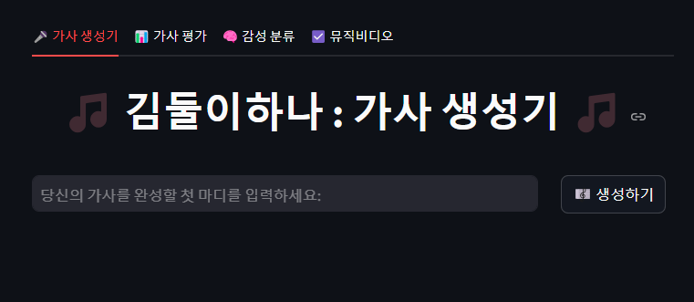
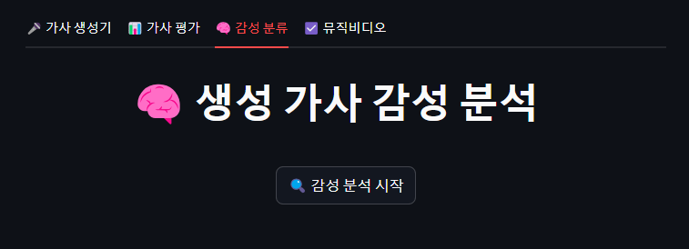
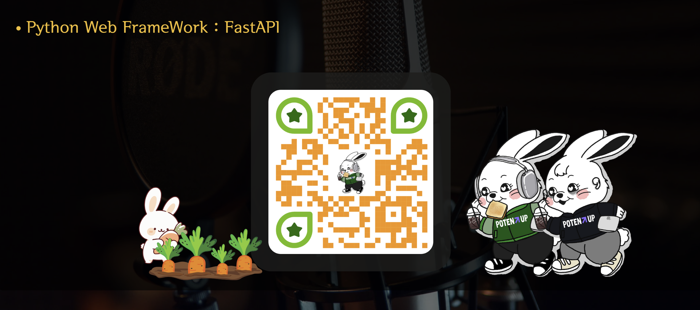

# "BE MY MUSE”
## GPT-2 기반 KoGPT를 활용한 감성 작사 모델 개발

### **역할 구성**
- 팀장 : 김형섭(hyeongseob)
- 팀원 : 이성복(SBLee-git)
- 팀원 : 김지민(shocho-kim)

### **프로젝트 기간**
- 2025.01 ~ 2025.01 (1달)

---
## 나의 역할

**멜론 사이트 기반 가사 데이터 크롤링 (정적 & 동적)
**수집 데이터 병합 및 전처리
**형태소 분석 및 감성 라벨링 테스트
**LSTM 및 마르코프 체인 기반 텍스트 생성 실험
**KoGPT2 파인튜닝 실험
**가사 유사도 분석 및 감정 분포 시각화

## 1. 프로젝트 개요

**MUSE Label에서 진행한 “BE MY MUSE” DACON 공모전에서 영감을 받아,**  
**입력한 키워드만으로도 작사가가 의도하는 감성과 분위기를 반영한 가사를 자동 생성하는 AI 언어 모델을 개발합니다.**  
**이를 통해 작사가의 아이디어 발상 과정을 보조하는 창작 지원 도구를 구현하는 것을 목표로 합니다.**  

- <a href="https://www.canva.com/design/DAGd1CW20wA/MfQJQDQdldA8Qs6XvhyuLg/edit?utm_content=DAGd1CW20wA&utm_campaign=designshare&utm_medium=link2&utm_source=sharebutton"> 프로젝트 발표 자료 링크 </a>

---

## 2. 기술 스택
| 구분    | 기술 및 라이브러리          |
|------------|-------------------------------------------|
| 언어    | Python 3.11             |
| 프레임워크 | FastAPI, uvicorn, Streamlit         |
| AI 모델   | KoGPT2("skt/kogpt2-base-v2") : Fine-tuning Model 사용|
| 평가 기준  | BLEU Score, ROUGE Score, PPL(Perplexity)  | 
| 라이브러리  | Pytorch, Scikit-Learn, Transformers, Pandas, Numpy, Matplotlib, Seaborn, KoNLPy  |
| 크롤링   | BeautifulSoup4, Selenium    |

---

## 3. 프로젝트 구현 절차

**데이터 수집 및 전처리**  
- 멜론 차트·가사 크롤링 (7,439곡 수집)
- 중복 제거·정규화·토큰화 후 학습/검증 데이터셋 생성 (4,840곡의 Dataset 확보)

**출력 값 도출 2가지 방법 검증**    
- **방식 A**: 파인튜닝된 KoGPT2 모델을 활용하여 입력 키워드 기반으로 자연스럽게 이어지는 텍스트 생성  
- **방식 B**: KoNLPy 라이브러리를 이용해 국립국어원 표준 형태소 분석·조합 기법으로 문장 구조를 재구성하는 방식

**승인된 모델 선택**  
- KoGPT2("skt/kogpt2-base-v2") Fine-Tuning 방식 선택
- 하이퍼파라미터 설정 (lr, batch size, epochs)  
- 확보한 데이터셋과 설정 된 값으로 Fine-Tuning 수행 

**학습 검증 및 테스트**  
- 테스트셋으로 자동 생성 가사 평가  
- BLEU·ROUGE·Perplexity 지표 산출
- 시각화 도구 활용하여 객관적 지표 도출

  

**출력 텍스트 감성 분류**  
- KOTE 모델로 43개 감정 카테고리 분류  
- 감성 분포 비율 계산 및 시각화

**사용자 서비스 구현 (FastAPI, Streamlit)**  
- REST API: 키워드 입력 → 가사 생성 엔드포인트  
- Streamlit UI: 실시간 키워드 입력 및 결과 출력  
  
---

## 4. 사용자 서비스 화면
### 서비스 시작 화면

### 키워드 입력 후 생성하기 버튼 클릭

  

 
### 생성된 텍스트 감성 분석 시각화

  

### 생성된 텍스트 성능 평가 시각화

  

---

## 5. 사용자 방문 경로
### 웹 서비스 QR 코드  
 

---

## 문의
- E-MAIL : rukais2294@gmail.com
- Kakaotalk : KeemHS91
