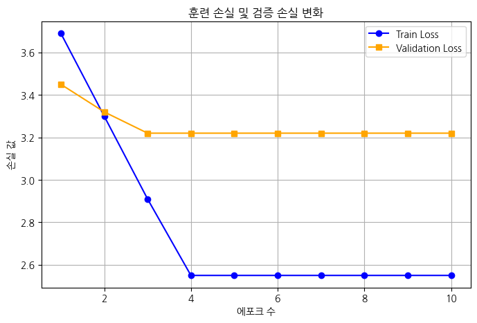
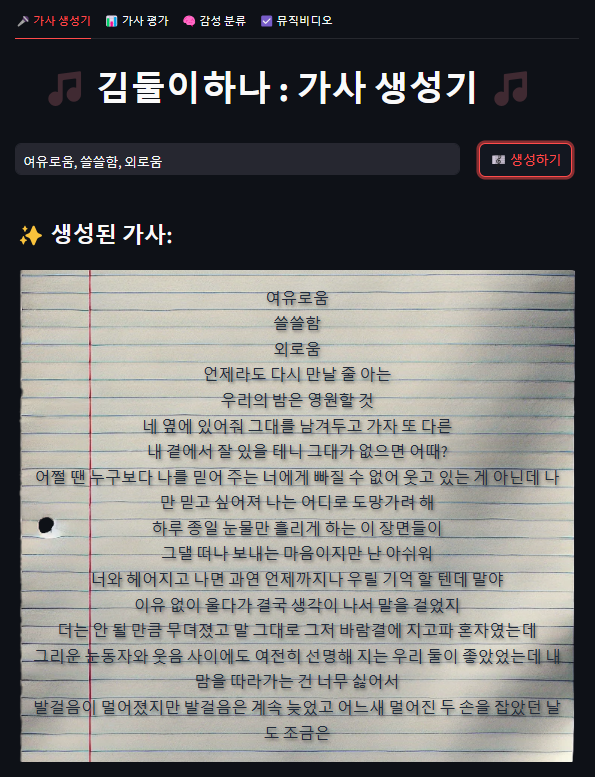
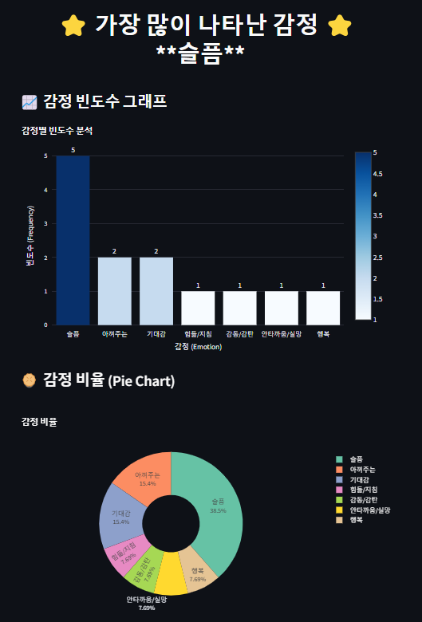
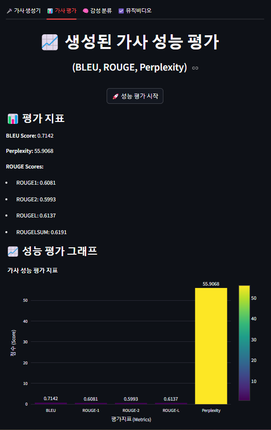

# "BE MY MUSE”
## GPT-2 기반 KoGPT를 활용한 감성 작사 모델 개발

### **인원 구성**
- 팀장 : 김형섭(hyeongseob)
- 팀원 : 이성복(SBLee-git)
- 팀원 : 김지민(shocho-kim)

---

## 1. 프로젝트 개요
- ‘다이어리(노래 가제)’ 주제 감성 작사가 공모전용 AI 모델 개발  
- 키워드 입력 시 “나만의 진솔한” 맞춤형 가사 자동 생성 목표
- <a href="https://www.canva.com/design/DAGd1CW20wA/MfQJQDQdldA8Qs6XvhyuLg/edit?utm_content=DAGd1CW20wA&utm_campaign=designshare&utm_medium=link2&utm_source=sharebutton"> 프로젝트 발표 자료 링크 </a>

---

## 2. 기술 스택
| 구분    | 기술 및 라이브러리          |
|------------|-------------------------------------------|
| 언어    | Python 3.11             |
| 프레임워크 | FastAPI, uvicorn, Streamlit         |
| AI 모델   | KoGPT2("skt/kogpt2-base-v2") : Fine-tuning Model 사용|
| 평가 기준  | BLEU Score, ROUGE Score, PPL(Perplexity)  | 
| 라이브러리  | Pytorch, Scikit-Learn, Transformers, Pandas, Numpy, Matplotlib, Seaborn, KoNLPy  |
| 크롤링   | BeautifulSoup4, Selenium    |

---

## 3. 프로젝트 구현 절차

**데이터 수집 및 전처리**  
- 멜론 차트·가사 크롤링 (7,439곡 수집)
- 중복 제거·정규화·토큰화 후 학습/검증 데이터셋 생성 (4,840곡의 Dataset 확보)

**출력 값 도출 2가지 방법 검증**    
- **방식 A**: 파인튜닝된 KoGPT2 모델을 활용하여 입력 키워드 기반으로 자연스럽게 이어지는 텍스트 생성  
- **방식 B**: KoNLPy 라이브러리를 이용해 국립국어원 표준 형태소 분석·조합 기법으로 문장 구조를 재구성하는 방식

**승인된 모델 선택**  
- KoGPT2("skt/kogpt2-base-v2") Fine-Tuning 방식 선택
- 하이퍼파라미터 설정 (lr, batch size, epochs)  
- 확보한 데이터셋과 설정 된 값으로 Fine-Tuning 수행 

**학습 검증 및 테스트**  
- 테스트셋으로 자동 생성 가사 평가  
- BLEU·ROUGE·Perplexity 지표 산출
- 시각화 도구 활용하여 객관적 지표 도출
 

**출력 텍스트 감성 분류**  
- KOTE 모델로 43개 감정 카테고리 분류  
- 감성 분포 비율 계산 및 시각화

**사용자 서비스 구현 (FastAPI, Streamlit)**  
- REST API: 키워드 입력 → 가사 생성 엔드포인트  
- Streamlit UI: 실시간 키워드 입력 및 결과 출력  
  
---

## 4. 사용자 서비스 화면
**서비스 시작 화면**
 
 
 

**키워드 입력 후 생성하기 버튼 클릭**
 
 
 **생성된 텍스트 감성 분석 시각화**
 

 **생성된 텍스트 성능 평가 시각화**
  

---

## 5. 사용자 방문 경로
**웹 서비스 QR 코드**  
  

---

## 문의
- E-MAIL : rukais2294@gmail.com
- Kakaotalk : KeemHS91
